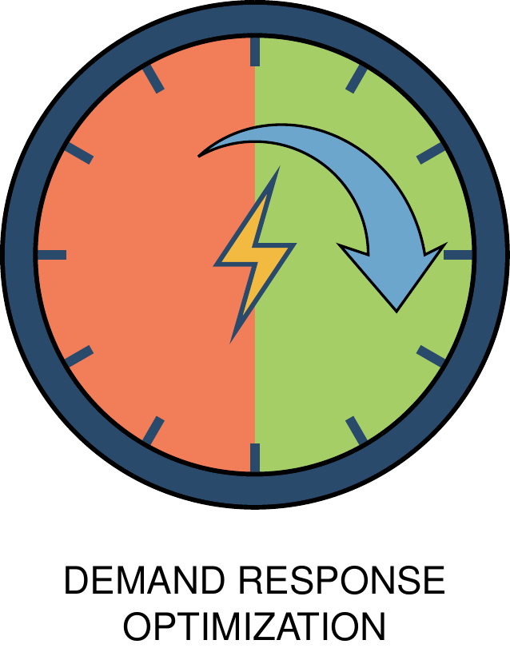

<div align="center">
  
</div>

<div align="center">

# Energy demand response optimization using virtual storage modeling

[](https://www.python.org/downloads/)
[](https://opensource.org/licenses/MIT)
<!-- [](https://badge.fury.io/py/demand-response) -->
[](https://github.com/ahmadimam657/demand-response/actions/workflows/tests.yml)

</div>

`demand-response` helps you optimize energy costs by intelligently shifting electricity demand across time periods using Mixed Integer Linear Programming (MILP). The library models energy flexibility as a virtual battery that can store and release energy to minimize total purchasing costs while respecting physical and operational constraints.

## Features

• 🔋 **Virtual Storage Modeling**: Models demand response as a virtual battery without explicit storage level constraints  
• 💰 **Cost Optimization**: Minimizes total energy costs including spot prices and regulation market participation  
• 🔄 **Moving Horizon Control**: Implements receding horizon optimization for real-time decision making  
• 🔧 **Multiple Solver Support**: Compatible with both open-source (python-mip/CBC) and commercial (Gurobi) solvers  
• 📈 **Reserve Market Integration**: Supports upregulation and downregulation market participation  
• ⚙️ **Flexible Constraints**: Configurable demand advance/delay limits and transfer rates

## Requirements

• Python 3.8 or higher  
• NumPy and Pandas for data handling  
• tqdm for progress tracking  
• One of the following solvers:
  - **python-mip** (open-source, uses CBC solver)  
  - **Gurobi** (commercial, requires license)

## How It Works - Transfer Matrix Optimization

The optimization engine uses a transfer matrix approach to determine optimal energy movement between time periods. This animated visualization shows how energy demand can be shifted from expensive to cheaper time periods:

<div align="center">
  
</div>

### Transfer Matrix Concept

The optimization uses a transfer matrix `T[i,j]` to determine optimal energy movement:

```
T[i,j] = Amount of energy originally demanded at time i,
         but actually purchased at time j to minimize costs
```

**Example:**
```python
Original demand: [10, 15, 8, 12] kWh
Energy prices:   [30, 80, 20, 40] ct/kWh
Original cost:   10×30 + 15×80 + 8×20 + 12×40 = 2140 ct

# Optimal strategy: Move 10 kWh from expensive hour 1 to cheap hour 2
Modified purchases: [10, 5, 18, 12] kWh
New cost:          10×30 + 5×80 + 18×20 + 12×40 = 1540 ct
Savings:           600 ct (28% reduction)
```

### Objective Function

The system minimizes:
```
Σ[purchase[t] × price[t] + pos_dev[t] × down_price[t] - neg_dev[t] × up_price[t]]
```

Where:
- `purchase[t]`: Actual energy purchased at time t
- `pos_dev[t]`: Positive deviation from reference (consuming more)
- `neg_dev[t]`: Negative deviation from reference (consuming less)
- `price[t]`: Spot market price
- `down_price[t]`: Downregulation price deviation (typically ≤0)
- `up_price[t]`: Upregulation price deviation (typically ≥0)

## Installation

### From PyPI (recommended)

To use `demand-response` in your project, install it from PyPI:

```bash
pip install demand-response
```

### From source (for examples and development)

If you want to explore the examples or contribute to the project, follow these
steps to install from source:

```bash
# Clone repository
git clone https://github.com/ahmadimam657/demand-response.git
cd demand-response

# Install package and development dependencies
uv sync
```

#### Alternative installation with pip

```bash
# Install in development mode
pip install -e .

# Or install dependencies manually
pip install numpy pandas tqdm mip  # Basic installation
pip install gurobipy              # For commercial solver (requires license)
```

## Basic Usage

Optimize energy demand using simple function calls. You first create a `VirtualStorage` instance with your configuration, then either run single optimization or use the moving horizon controller for multi-period optimization.

```python
import pandas as pd
import numpy as np
from demand_response import VirtualStorage, moving_horizon

# Configure optimization parameters (FIXED VERSION)
config = {
    'daily_decision_hour': 6,      # Make decisions at 6 AM
    'n_lookahead_hours': 48,       # 48-hour optimization horizon
    'virtual_storage': {
        'max_demand_advance': 12,   # Can buy energy 12 hours early (increased for feasibility)
        'max_demand_delay': 12,     # Can buy energy 12 hours late
        'max_hourly_purchase': 20.0, # Max 20 kWh transfer per hour (increased for feasibility)
        'max_rate': 10.0,          # Max 10 kWh transfer rate (increased for feasibility)
        'solver': 'mip'            # Use open-source solver
    }
}

# Prepare your data
dates = pd.date_range('2024-01-01', periods=48, freq='h')
price_data = pd.DataFrame({
    'price': np.random.uniform(20, 80, 48)  # ct/kWh
}, index=dates)
demand_data = pd.DataFrame({
    'demand': np.random.uniform(8, 15, 48)  # kWh
}, index=dates)

# Run optimization
result = moving_horizon(price_data, demand_data, config)

# Access results
optimized_demand = result['results']['demand']
demand_shifts = result['results']['shift']

# Calculate cost savings
original_cost = (price_data['price'] * demand_data['demand']).sum()
optimized_cost = (price_data['price'] * optimized_demand).sum()
cost_savings = original_cost - optimized_cost
savings_percentage = (cost_savings / original_cost) * 100
```

### Configuration Options

The configuration dict supports four main sections:

• `daily_decision_hour`: Hour of day (0-23) for making optimization decisions  
• `n_lookahead_hours`: Length of optimization horizon (≥24 hours)  
• `virtual_storage`: Core settings for the virtual storage model  
• `solver_params`: Optional solver-specific parameters

You can view example configurations by checking the test files:

```python
# See example configurations in tests/
import demand_response
print("Check tests/ folder for configuration examples")
```

### Single Horizon Optimization

For single optimization window without moving horizon:

```python
import numpy as np
from demand_response import VirtualStorage
# Create pyramid price profile (9 values, peak in middle)
prices = np.array([1.0, 2.0, 3.0, 4.0, 5.0, 4.0, 3.0, 2.0, 1.0])

# Create single peak demand at the center (time index 4)
demand = np.array([0.0, 0.0, 0.0, 0.0, 1.0, 0.0, 0.0, 0.0, 0.0])

storage = VirtualStorage(
    max_demand_advance=2,
    max_demand_delay=3,
    max_hourly_purchase=1.0,
    max_rate=1.0,
    solver='mip',
)

result = storage.optimize_demand(prices, demand)
optimized_demand = result["optimal_demand"]
```

## Examples

The repository includes example scripts demonstrating various use cases:

### Example 1: Basic optimization

```bash
# Run basic demand response optimization
uv run python examples/basic_optimization.py
```

### Example 2: Moving horizon with market participation

```bash
# Multi-period optimization with reserve markets
uv run python examples/moving_horizon_optimize.py
```

### Example 3: Solver comparison

```bash
# Compare open-source vs commercial solver performance
uv run python examples/solver_comparison.py
```

## Repository Layout

```
├── src/demand_response/      # Library code
│   ├── __init__.py
│   ├── virtual_storage.py    # Core MILP optimization
│   ├── moving_horizon.py     # Multi-period controller
│   ├── solver_adapters.py    # Unified solver interface
│   ├── time_ranges.py        # Time indexing utilities
│   ├── transfer_indices.py   # Transfer matrix operations
│   └── utils.py             # Logging and utilities
├── tests/                   # Test suite
├── assets/                  # Documentation assets
│   ├── logo.svg
│   └── transfer_matrix_animation.gif
├── examples/                # Usage examples
└── pyproject.toml          # Package configuration
```

## Development

Before committing or pushing run:

```bash
uv run ruff check .
uv run pytest
uv run pytest --cov=demand_response  # With coverage
```

### Running Tests

```bash
# Run all tests
uv run pytest

# Run specific test file
uv run pytest tests/test_virtual_storage.py

# Run with coverage
uv run pytest --cov=demand_response --cov-report=html
```

## Contributing

We welcome contributions! Please follow these steps:

1. Fork the repository
2. Create a feature branch (`git checkout -b feature/amazing-feature`)
3. Make your changes
4. Run the test suite (`uv run pytest`)
5. Commit your changes (`git commit -m 'Add amazing feature'`)
6. Push to the branch (`git push origin feature/amazing-feature`)
7. Open a Pull Request

Please ensure your code follows our style guidelines:

• Use Ruff for code formatting and linting  
• Include type annotations for all functions  
• Add tests for new functionality  
• Update documentation for API changes  
• Follow existing code patterns and conventions

## License

This project is released under the [MIT License](LICENSE).

## Authors

**Hafiz Muhammad Ahmad Imam**, **Johan Westö**

## Additional Links

- [Code](https://github.com/ahmadimam657/demand-response)
- [Issues](https://github.com/ahmadimam657/demand-response/issues)
- [Pull requests](https://github.com/ahmadimam657/demand-response/pulls)