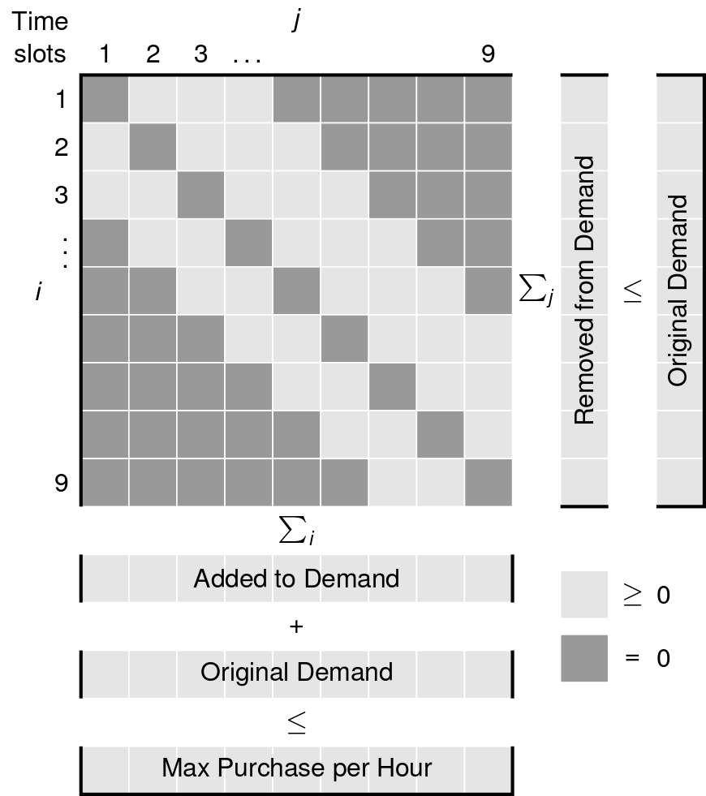
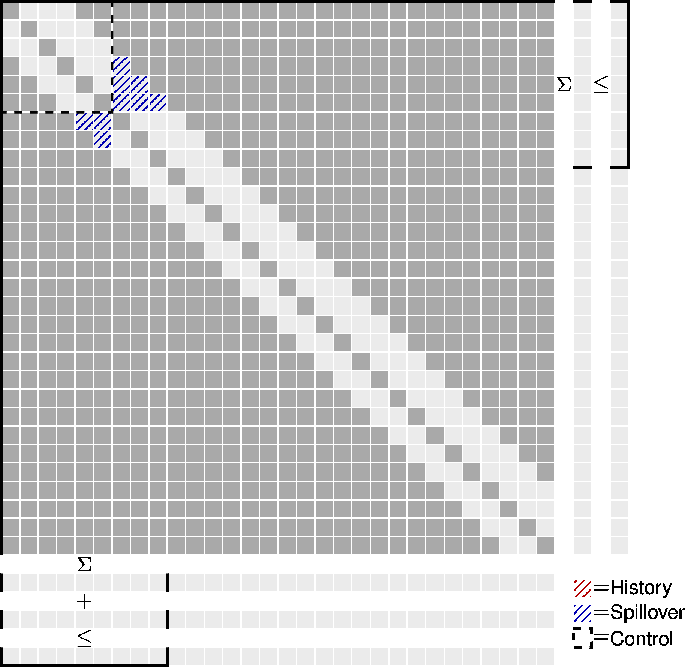
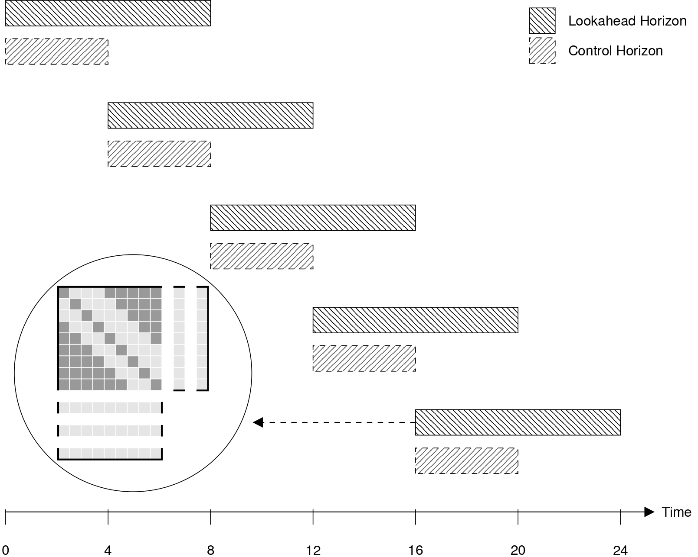

# Technical Documentation

## Transfer Matrix Fundamentals
<p align="justify">
The core of the demand response optimization is the **transfer matrix** approach, which models energy flexibility by allowing demand to be shifted across time periods.
</p>

### Transfer Matrix Concept
<p align="justify">

The transfer matrix `T[i,j]` represents the amount of energy originally demanded at time `i` but purchased at time `j`. This mathematical construct enables the optimizer to find the most cost-effective purchasing schedule while respecting physical constraints.

</p>

<div align="center">
  
</div>

### Matrix Structure

```
T[i,j] = Amount of energy originally demanded at time i,
         but purchased at time j to minimize total costs
```

**Key Properties:**
- **Diagonal elements** `T[i,i]`: Energy purchased at the originally demanded time
- **Off-diagonal elements** `T[i,j]` where `j≠i`: Energy shifted from time `i` to time `j`
- **Row sum** `Σⱼ T[i,j]`: Must equal the original demand at time `i`
- **Column sum** `Σᵢ T[i,j]`: Represents the actual energy purchased at time `j`

**Physical Constraints:**
- **Demand Advance**: Can buy energy up to `max_demand_advance` hours early
- **Demand Delay**: Can buy energy up to `max_demand_delay` hours late  
- **Transfer Limits**: Maximum energy transfer per hour (`max_hourly_purchase`)
- **Rate Limits**: Maximum transfer rate (`max_rate`)

**Example Transfer Matrix:**
```python
# Hour:           [0, 1, 2, 3, 4, 5, 6, 7, 8]  (Local time)
# Global Index:   [3, 4, 5, 6, 7, 8, 9,10,11]  (Absolute position)
Original demand:  [10,15, 8,12, 6, 9,14,11, 7] kWh
Energy prices:    [30,80,20,40,25,35,75,30,45] ct/kWh

# Optimal strategy: Move 10 kWh from expensive hour 1 (80 ct) to cheap hour 2 (20 ct)
Transfer matrix: T[4,5] = 10 kWh  (from global index 4 to 5)
Optimized demand: [10, 5,18,12, 6, 9,14,11, 7] kWh
Cost reduction:   10×(80-20) = 600 ct savings
```

## Moving Horizon Control Strategy
<p align="justify">
The optimization engine uses a **moving horizon control** strategy with the transfer matrix approach to determine optimal energy movement between time periods. This approach enables **real-time decision making** while maintaining **global cost optimization** across multiple days of operation. Each optimization horizon looks ahead `X` hours and makes decisions for a control period, then rolls forward to the next decision point. The moving horizon controller divides time into overlapping optimization windows
</p>

<div align="center">
  <table>
    <tr>
      <td></td>
      <td></td>
    </tr>
  </table>
</div>

**Key Time Periods:**
- **Lookback Hours**: Historical decisions from previous optimizations (fixed constraints)
- **Control Period**: Hours being actively optimized (typically 24 hours) 
- **Lookahead Period**: Future hours providing price/demand context (48+ hours total)
- **Spillover Effects**: Energy transfers from control period that affect future hours

### Horizon Rolling Process

The moving horizon algorithm works as follows:

1. **Decision Point**: At each daily decision hour (e.g., 6 AM)
2. **Horizon Setup**: Create optimization window (e.g., 48 hours ahead)
3. **Constraint Integration**: Apply spillover effects from previous optimization
4. **Matrix Optimization**: Solve transfer matrix to minimize costs
5. **Implementation**: Execute control period decisions (24 hours)
6. **Spillover Tracking**: Save energy transfers affecting future periods
7. **Roll Forward**: Move to next decision point and repeat

## Optimization Objective

### Objective Function

The optimization seeks to minimize total energy costs by strategically purchasing energy across time periods. At its core, the optimized demand at any time is:

```
Optimized demand = original + added - removed
```

Where energy can be added (purchased early) or removed (delayed to later periods) to take advantage of price variations while respecting physical constraints.

Each horizon minimizes total energy costs:
```
Minimize: Σ[purchase[t] * price[t] + pos_dev[t] * down_price[t] -
              neg_dev[t] * up_price[t]]
```

Where:
- `purchase[t]`: actual energy purchased at time t
- `pos_dev[t]`: max(0, purchase[t] - reference[t]) (consuming more than reference)
- `neg_dev[t]`: max(0, reference[t] - purchase[t]) (consuming less than reference)
- `reference[t]`: target consumption profile (defaults to demand[t])
- `price[t]`: spot price (e.g., day-ahead market price)
- `down_price[t]`: downregulation price deviation from spot (≤0, discount)
- `up_price[t]`: upregulation price deviation from spot (≥0, payment)

Reserve Market Context:

    - Downregulation: Consuming more (pos_dev) gets discount: down_price[t] < 0
    - Upregulation: Consuming less (neg_dev) earns payment: -up_price[t] < 0