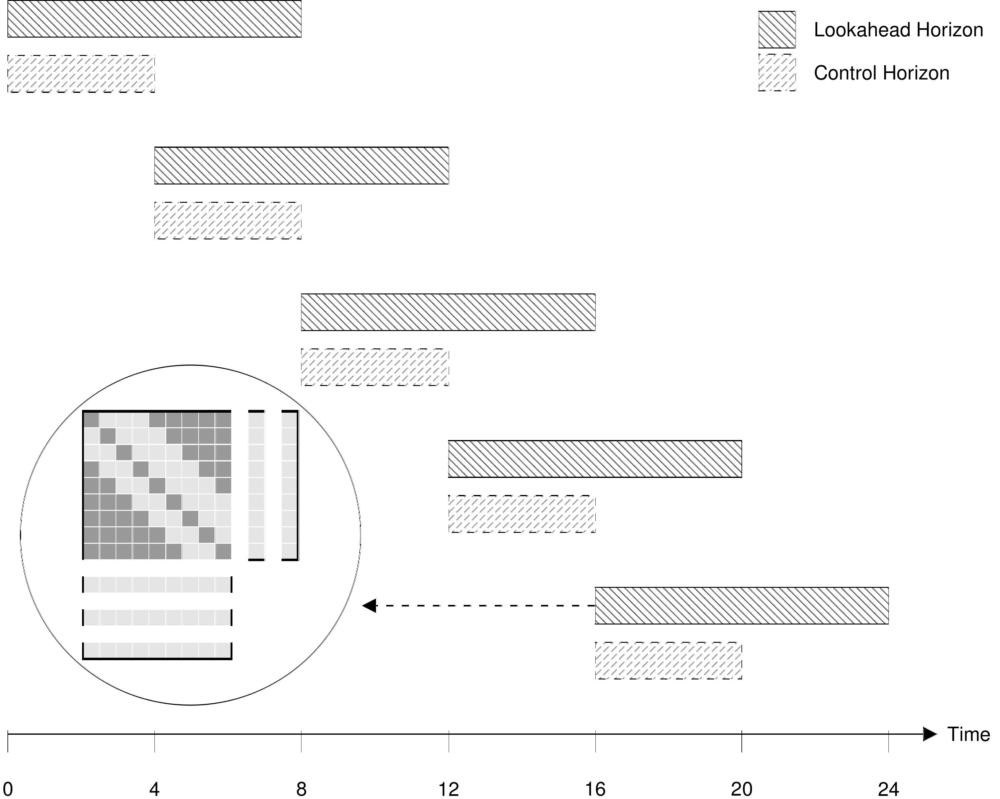

# Technical Documentation

## Transfer Matrix Fundamentals
<p align="justify">
The load is shifted from expensive hours to cheaper hours through a concept we call the **Transfer Matrix** - a mathematical framework that maps hour-to-hour energy transfers while respecting physical and operational constraints.
</p>

### Transfer Matrix Concept
<p align="justify">

The transfer matrix `T[i,j]` represents the amount of energy originally demanded at time `i` but purchased at time `j`. This mathematical construct enables flexible energy scheduling. For instance, with a flexibility window of 2 hours earlier(Demand Advance) or 3 hours later(Demand Delay) than originally scheduled, the matrix below reveals all possible load transfer combinations while respecting operational constraints.

</p>

<div align="center">
  
</div>

### Matrix Structure

**Key Properties:**
- **Row sum** `Σⱼ T[i,j]`: Represents the original demand at time `i`
- **Column sum** `Σᵢ T[i,j]`: Represents the actual energy purchased at time `j`

**Example Transfer Matrix:**
```python
# Hour:           [0, 1, 2, 3, 4, 5, 6, 7, 8]  (Local time)
# Global Index:   [3, 4, 5, 6, 7, 8, 9,10,11]  (Absolute position)
Original demand:  [10,15, 8,12, 6, 9,14,11, 7] kWh
Energy prices:    [30,80,20,40,25,35,75,30,45] ct/kWh

# Optimal strategy: Move 10 kWh from expensive hour 1 (80 ct) to cheap hour 2 (20 ct)
Transfer matrix: T[4,5] = 10 kWh  (from global index 4 to 5)
Optimized demand: [10, 5,18,12, 6, 9,14,11, 7] kWh
Cost reduction:   10×(80-20) = 600 ct savings
```

## Moving Horizon Control Strategy
<p align="justify">
The optimization engine uses a **moving horizon control** strategy to determine optimal energy movement between time periods. This approach enables **real-time decision making** while maintaining **global cost optimization** across multiple days of operation. Each optimization horizon looks ahead `X` hours and makes decisions for a control period (solve a simple tranfer matrix problem), then rolls forward to the next decision point. The spill over from current contro window optimization becomes constraints for the next control window.  The moving horizon controller divides time into overlapping optimization windows.
</p>

<div align="center">
  <table>
    <tr>
      <td></td>
      <td></td>
    </tr>
  </table>
</div>

**Key Time Periods:**
- **Lookback Hours**: Historical decisions from previous optimizations (constraints)
- **Control Period**: Hours being actively optimized (typically 24 hours) 
- **Lookahead Period**: Future hours providing price/demand context (48+ hours total)
- **Spillover Effects**: Energy transfers from control period that affect future hours

### Horizon Rolling Process

The moving horizon algorithm works as follows:

1. **Horizon Setup**: Create optimization window (e.g., 48 hours ahead)
2. **Constraint Integration**: Apply spillover effects from previous optimization
3. **Matrix Optimization**: Solve transfer matrix to minimize costs
4. **Spillover Tracking**: Save energy transfers affecting future periods
5. **Roll Forward**: Move to next decision point and repeat

## Optimization Objective

### Objective Function

The optimization seeks to minimize total energy costs by strategically purchasing energy across time periods. At its core, the optimized demand at any time is:

```
Optimized demand = original + added - removed
```

Where energy can be added (purchased early) or removed (delayed to later periods) to take advantage of price variations while respecting physical constraints.

Each horizon minimizes total energy costs:
```
Minimize: Σ[purchase[t] * price[t]]

```

Where:
- `purchase[t]`: actual energy purchased at time t
- `price[t]`: spot price (e.g., day-ahead market price)